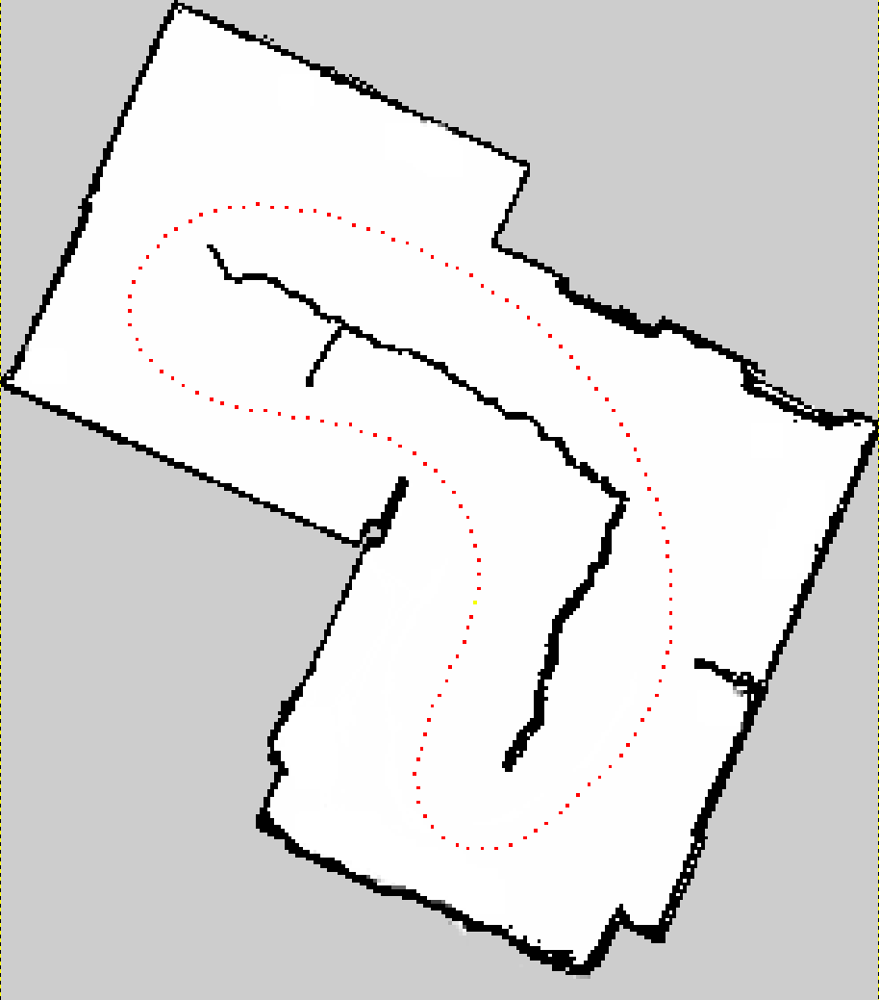
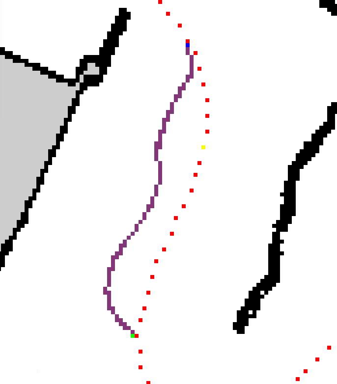
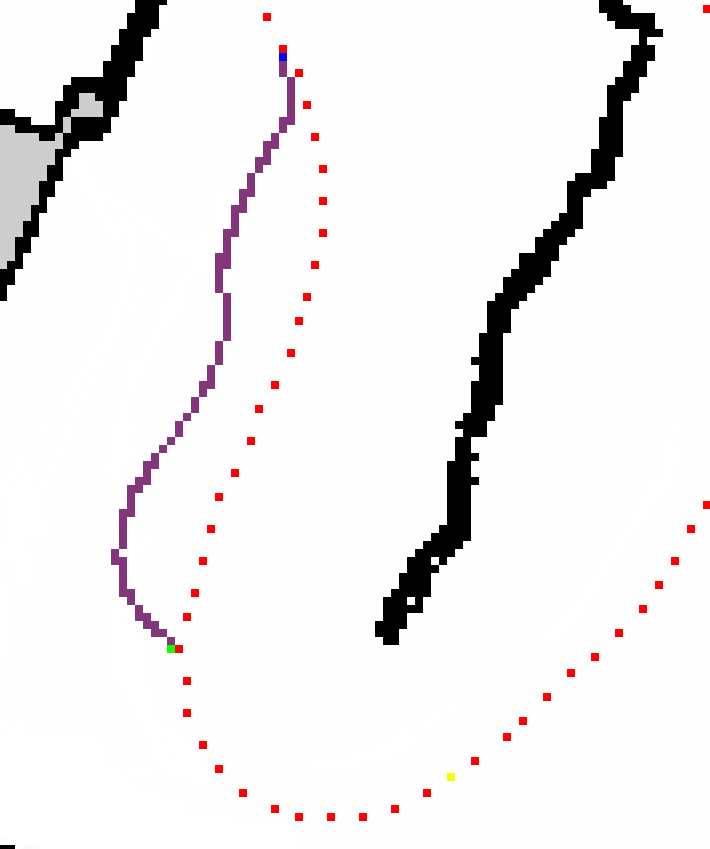
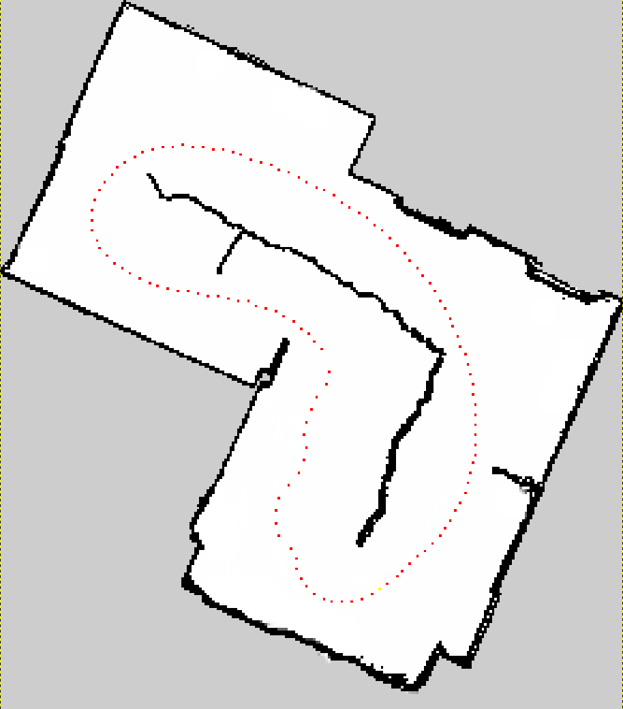

# Raceline Editor
A tool for editing and modifying racing lines through visual map manipulation using GIMP.

## Project Structure
```
raceline_editor/
├── assets/ ← images are here
├── config/ ← configurations
├── mod_maps/ ← Modified maps go here (mod_map.png)
├── original_maps/ ← original maps go here (map.png and map.yaml)
├── original_racinglines/ ← Place your input racingline files here (input_racingline.csv)
├── output_racinglines/ ← Final extracted racing lines output (output_racingline.csv)
├── path_extractor/src/
│ └── extractor.py ← Extractor script
├── racingline_drawer/src/
│ └── drawer.py ← Drawer script
└── README.md
```

## Configuration

The project uses configuration enums to manage file paths, colors, and processing parameters. Understanding these configurations is essential for proper setup and customization.

### Drawer Configuration (`drawer_config`)

Controls the drawing process that generates the visual map for GIMP editing:

| Parameter | Default Value | Description |
|-----------|--------------|-------------|
| `MAP_YAML` | `original_maps/map.yaml` | Path to the original track map YAML file containing track layout data |
| `RACING_CSV` | `original_racinglines/input_racingline.csv` | Input CSV file containing the original racing line coordinates |
| `OUTPUT_MAP` | `mod_maps/mod_map.png` | Output path where the generated PNG map for GIMP editing will be saved |
| `FIRST_LAST_POINT_COLOR` | `#f6ff00` (Yellow) | Color for the first and last points of the racing line (they are the same point in a closed loop) |
| `OTHER_POINTS_COLOR` | `#ff0000` (Red) | Color for all other racing line points |

### Extractor Configuration (`extractor_config`)

Controls the extraction process that converts your GIMP-edited map back into racing line data:

| Parameter | Default Value | Description |
|-----------|--------------|-------------|
| `MOD_MAP_PATH` | `mod_maps/mod_map.png` | Path to the GIMP-modified map file |
| `MAP_YAML` | `original_maps/map.yaml` | Same track map YAML file used in drawing |
| `RACING_CSV` | `original_racinglines/input_racingline.csv` | Original racing line CSV (used for reference) |
| `OUTPUT_CSV` | `output_racinglines/output_racingline.csv` | Final output CSV containing the extracted racing line |
| `TEMP_RACING_CSV` | `path_extractor/temp_csvs/temp_racingline.csv` | Temporary CSV file used during processing |
| `DISCRETIZATION_STEP` | `5` | Step size for path discretization (affects path resolution) |
| `NOT_VELOCITY` | `-999` | Placeholder value used for velocity when not available |

### State Configuration (`State`)

Defines the color coding for different pixel types in GIMP editing:

| State | Color Code | Color | Usage |
|-------|------------|-------|-------|
| `START` | `#11ff00` | Bright Green | Mark the starting point of your racing line |
| `END` | `#0a00ff` | Blue | Mark the ending point of your racing line |
| `PATH` | `#84367b` | Purple | Mark the racing line path pixels |

### Customizing Configuration

**Important:** You may need to update the file paths in the configuration files to match your system setup:

1. **File Paths**: Ensure all paths point to the correct directories in your project structure
2. **Color Customization**: You can modify the colors by changing the hex values:
   - Use any valid hex color code (e.g., `#FF0000` for red)
   - Ensure colors are distinct enough to differentiate in GIMP
   - Avoid using colors that might conflict with track elements

3. **Processing Parameters**:
   - **DISCRETIZATION_STEP**: Lower values (1-3) = higher resolution, more points
   - **DISCRETIZATION_STEP**: Higher values (5-10) = lower resolution, fewer points

## Dependencies
The project uses the following Python libraries:
- `math` (hypot)
- `shutil`
- `queue` (Queue)
- `PIL` (Pillow)
- `yaml`
- `csv`
- `argparse`
- `cv2` (OpenCV)
- `pandas`
- `os`

Install the required packages:
```bash
pip install pillow pyyaml opencv-python pandas
```

## Usage Instructions

### Step 1: Prepare Input Files
Place your input racingline files inside the `original_racinglines/` directory.

### Step 2: Generate Visual Map
Run the drawer script to create a visual representation of your racing line:
```bash
python3 -m racingline_drawer.src.drawer
```


### Step 3: Edit in GIMP
1. Open GIMP
2. Open the generated `mod_map.png` file from the `mod_maps/` directory



### Step 4: Handle Yellow Configured Pixel
⚠️ **Important**: If your path is revolving around the yellow 'configured' pixel (`#f6ff00`), you need to relocate it to prevent the modified path from creating a bridge between the yellow pixel and the path.



### Step 5: Edit the Path
Carefully place your pixels using the specific colors defined in the State configuration:

1. **Start pixel** - Use bright green (`#11ff00`) to mark the beginning of your modified path
2. **Path pixels** - Use purple (`#84367b`) to draw your desired racing line
3. **End pixel** - Use blue (`#0a00ff`) to mark the end of your modified path

**Critical Requirements:**
- All pixels must be close to each other within the 8 directions (horizontally, vertically, and diagonally adjacent)
- Ensure continuity between start, path, and end pixels
- No gaps should exist in your pixel chain
- Use exact hex colors as specified in the State enum

### Step 6: Extract Modified Racing Line
Run the extractor script to generate the final racing line:
```bash
python3 -m path_extractor.src.extractor
```
The output will be saved in the `output_racinglines/` directory.

### Step 7: Verification (Optional)
To verify your modifications:
1. Copy the output racingline from `output_racinglines/` to `original_racinglines/`
2. Run the drawer script again:
   ```bash
   python3 -m racingline_drawer.src.drawer
   ```
3. Check the generated visual map to confirm your changes



## Tips
- Always ensure pixel connectivity when drawing your path in GIMP
- Use the zoom feature in GIMP for precise pixel placement
- Save your work frequently when editing in GIMP
- Keep backups of your original racingline files before making modifications
- Use the exact hex colors specified in the configuration for proper recognition by the extractor

## Troubleshooting
- **Path not extracting properly**: Verify that all pixels in your path are properly connected and use the correct colors
- **Yellow pixel conflicts**: Ensure the yellow configured pixel (`#f6ff00`) is not interfering with your path
- **Color recognition issues**: Make sure you're using the exact hex colors defined in the State configuration
- **File path errors**: Check that all directories exist and configuration paths are correct for your system